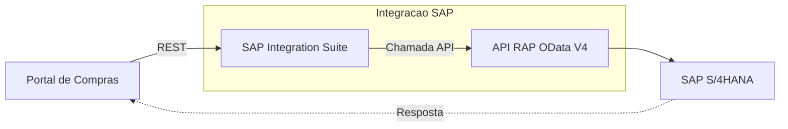

# Integração de Sistemas com SAP

Exemplo de fluxo com agrupamento.

```mermaid
flowchart LR
    A[Portal de Compras]
    subgraph Integracao SAP
        B[SAP Integration Suite]
        C[API RAP OData V4]
        B -->|Chamada API| C
    end
    D[SAP S/4HANA]
    A -->|REST| B
    C --> D
    D -.->|Resposta| A
```
